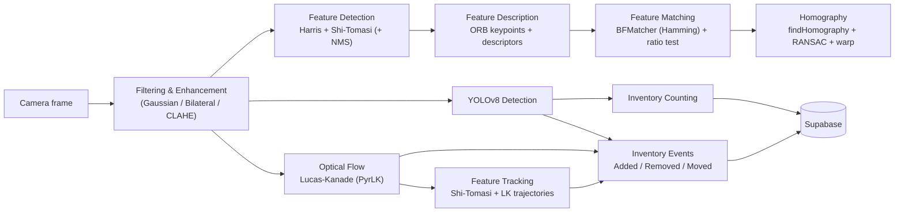
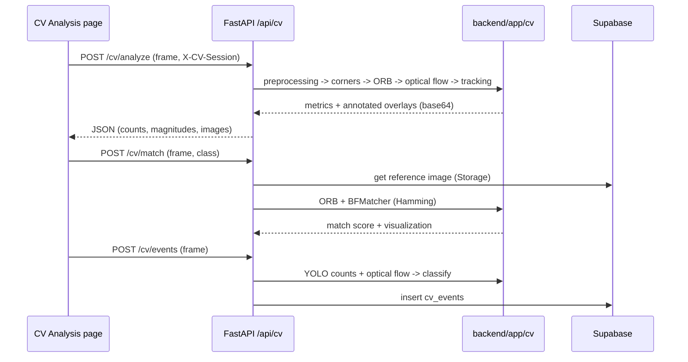

# Computer Vision Pipeline (Academic Report Support)

This document maps the classical Computer Vision topics taught in the course to
their concrete implementation in the Smart Fridge AI project. It is intended
for the final-project report and presentation.

The classical CV layer is additive: the original YOLOv8 detection and inventory
pipeline is unchanged. The new modules live under
[backend/app/cv/](../backend/app/cv) and are surfaced on the
`/computer-vision-analysis` dashboard page.

## End-to-end pipeline



## Per-frame data flow on the CV page



## Course topic to module mapping

| # | Course topic | Module | Key OpenCV call(s) |
|---|--------------|--------|--------------------|
| 1 | Image Filtering & Enhancement | [preprocessing.py](../backend/app/cv/preprocessing.py) | `GaussianBlur`, `bilateralFilter`, `createCLAHE` |
| 2 | Harris Corner Detection | [corners.py](../backend/app/cv/corners.py) | `cornerHarris` |
| 3 | Shi-Tomasi Good Features | [corners.py](../backend/app/cv/corners.py) | `goodFeaturesToTrack` |
| 4 | Non-Maximum Suppression | [corners.py](../backend/app/cv/corners.py) | `dilate` + local-max mask (`non_max_suppression`) |
| 5 | ORB Descriptors | [orb_features.py](../backend/app/cv/orb_features.py) | `ORB_create`, `detectAndCompute` |
| 6 | Feature Matching | [matching.py](../backend/app/cv/matching.py) | `BFMatcher(NORM_HAMMING)`, `knnMatch`, ratio test |
| 7 | Homography | [homography.py](../backend/app/cv/homography.py) | `findHomography(RANSAC)`, `warpPerspective` |
| 8 | Optical Flow | [optical_flow.py](../backend/app/cv/optical_flow.py) | `calcOpticalFlowPyrLK` |
| 9 | Feature-Based Tracking | [tracking.py](../backend/app/cv/tracking.py) | `goodFeaturesToTrack` + `calcOpticalFlowPyrLK` |
| 10 | Inventory Events (applied) | [events.py](../backend/app/cv/events.py) | YOLO counts + flow magnitude |
| 11 | Stereo Vision / 3D (bonus) | [stereo.py](../backend/app/cv/stereo.py) | `StereoBM`, `reprojectImageTo3D` |

## API surface

All routes are under `/api/cv` ([backend/routers/cv.py](../backend/routers/cv.py)):

| Method | Path | Purpose |
|--------|------|---------|
| POST | `/cv/analyze` | Filtering + corners + ORB + optical flow + tracking metrics & overlays |
| GET | `/cv/metrics` | Latest metrics for the session |
| POST | `/cv/reset` | Clear the session frame/track buffer |
| POST | `/cv/match` | ORB + BFMatcher against a stored reference |
| POST | `/cv/homography` | findHomography + RANSAC (+ optional warp) |
| POST | `/cv/events` | Classify Added/Removed/Moved and persist |
| GET | `/cv/events` | Recent persisted events |
| POST | `/cv/reference/{class}` | Upload a reference image (Supabase Storage) |
| GET | `/cv/reference/{class}` | Fetch a reference image |

## Notes for the demo

- Optical flow, tracking, and events need consecutive frames. The backend keeps
  an in-memory per-session buffer keyed by the logged-in `user_id` or the
  `X-CV-Session` header (sent automatically by the frontend).
- Reference images for matching are stored in the Supabase Storage bucket
  `food-references` (created by [supabase_migration_cv.sql](../supabase_migration_cv.sql)).
- Preprocessing mode (`none` / `gaussian` / `bilateral` / `clahe`) is selectable
  from Settings and the CV page, and is applied before YOLO as well.
- Stereo/3D is a single-camera demonstration only (no calibrated rig), included
  for academic completeness of topics 10-11.

## OpenCV experiment metrics (from YOLO dataset)

You do **not** need a separate dataset for classical CV. Re-use YOLO images +
bounding-box labels and run:

```powershell
python scripts/eval_cv_opencv.py --data dataset_2/data.yaml --split valid --max-images 80
```

Outputs:

- `results/cv_experiment/opencv_metrics.json` — raw numbers
- `results/cv_experiment/opencv_report.md` — tables for your report

Metrics include preprocessing (PSNR, ORB count), Harris/Shi-Tomasi corners,
ORB match discrimination, optical-flow error, homography inlier ratio, plus
YOLO mAP from `runs/detect/` as reference.
